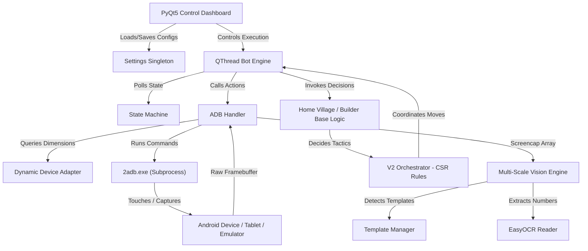

# 🤖 Clash of Clans Auto Farmer Bot

<div align="center">
  <a href="README.md">🇺🇸 English</a> | <a href="README_AR.md">🇸🇦 العربية</a>
</div>

<br />

<div align="center">
  
  
  
  
  
  
</div>

<br />

An advanced, non-intrusive auto-farming bot for **Clash of Clans**. Powered by a universal **Dynamic Multi-Device Computer Vision Engine** (OpenCV scale-variance template matching) and OCR (EasyOCR). It operates 100% safely via Android Debug Bridge (ADB) screenshot analysis and touch emulations, letting the game play itself to collect resources, train armies, and execute strategic attacks on **any device size, tablet (4:3 / 16:10), smartphone (16:9 / 20:9), or PC emulator** without modifying game files or injecting code.

---

> [!WARNING]
> **EDUCATIONAL & FAIR PLAY DISCLAIMER**
> This repository is a technical demonstration of PyQt5, OpenCV, and accessibility automation. It does **not** read game process memory, manipulate network packets, or modify game files. All actions are simulated at the OS level. However, using automated tools in online multiplayer games violates the publisher's Terms of Service and can result in account suspension. Use this framework responsibly and at your own risk.

---

## 🎮 What is this Bot? (For Players)

Tired of spending hours grinding for Gold, Elixir, and Dark Elixir? This bot acts as your **virtual gameplay assistant**, running on your computer and playing the game on an Android device or emulator exactly like a human player.

### 🌟 Key Player Features
- **📱 Universal Multi-Device Support:** Auto-detects device resolution (`wm size`) and screen density (`wm density`). Adapts dynamically to tablets (iPad 4:3, Galaxy Tab 16:10), modern smartphones, and emulators (LDPlayer 9, BlueStacks 5) without fixed resolution bounds.
- **🖼️ Universal Single-Template Matching:** One set of template images works across all devices, screen sizes, and custom sceneries (Dark Scenery, Snow Scenery, Jungle Scenery). No need to re-capture templates for different screens.
- **⚡ 5 Performance Profiles & Smart Default:** Features 4 preset profiles (`Ultra`, `High`, `Medium`, `Low`) + 1 `Smart Adaptive Default Profile` linked to **Reset to Default**. Auto-tunes CPU tick rates, OCR workers, and vision confidence thresholds for weak laptops up to 4K gaming rigs.
- **🛡️ Low-Spec Hardware Optimization:** Includes safe CPU/GPU fallback for EasyOCR and exception-wrapped OpenCV operations to guarantee zero crashes on low-end dual-core laptops.
- **🛡️ Level-Invariant Troop Recognition:** Combines Sobel gradient edge maps with inner center-face crops so troop icons match reliably regardless of level upgrades, stars, or frame changes.
- **Auto-Farming & Loot Filtering:** Scans bases using OCR to read available gold and elixir. If loot is below your minimum settings, it automatically skips the base and searches for a richer target.
- **Smart Deployment & Strategic Attacks:** Drops troops, heroes, and spells based on real combat logic (avoids red zones, creates paths, and targets specific defenses).
- **Auto-Training:** Detects when troops are missing and opens the training screen to queue up predefined armies.
- **Hero Abilities Management:** Monitors heroes and activates their special abilities after a customizable delay or when health drops.
- **Multi-Stage Builder Base (BB) Automation:** Searches for matches in the Builder Base, drops heroes and troops, activates abilities, and transitions automatically to Stage 2.
- **Anti-Stuck & Auto-Reload:** Automatically detects connection drops, clicks "Reload", and handles unexpected popups to keep running 24/7.

---

## ⚔️ Combat Efficiency & Army Composition

> [!IMPORTANT]
> ### 🎯 Attack Success Rate (CSR Performance)
> The bot's smart vision engine achieves an **80% success rate (8 out of 10 matches)**. Margin of error is minimized through dynamic red-zone contour detection and adaptive corridor planning.

### 🏹 Optimized Army Composition (TH Universal Link)
This composition has been extensively benchmarked and works across **all Town Hall levels**.

| 📱 Direct Army Copy Link |
| :--- |
| [🚀 Click Here to Copy This Army Layout Directly Into Your Game!](https://link.clashofclans.com/en?action=CopyArmy&army=h0p1e10_14-1p3e17_20-2m1p8e24_4-4p4e6_40i11x5-1x52-1x91d1x16u8x5-10x59-1x62-1x87-1x75s5x5-3x2) |

---

## ⚔️ Available Attack Strategies

The bot features a **Config-Skills-Rules (CSR)** combat system that analyzes your army composition and targets to choose the best strategy.

| Attack Rule | Targeted Army Type | How it Works (Combat Mechanics) |
| :--- | :--- | :--- |
| **Resource Raid (Storage Farm)** | Cheap units (Barbarians, Goblins, Archers) | Scouts the base by dropping individual troops on storages to trigger traps, then unloads the main wave on the closest safe spot to grab loot. |
| **Ground Funneling** | Tanky + DPS units (Giants/Golems + Wizards/P.E.K.K.As) | Drops tanks and support units on the left/right margins to clear outer buildings, creating a "funnel" that forces your main force into the center. |
| **Air Fan (Electro Dragon/Dragons)** | Air units (Dragons, E-Dragons, Balloons) | Deploys air units in a wide line along the safest corridor. Casts Rage and Freeze spells on Air Defenses, Inferno Towers, or Eagle Artilleries. |
| **Town Hall Snipe** | Any balanced army | Scans the playfield for the Town Hall. If placed near outer edges, the bot deploys units along the closest safe path to secure a quick star. |
| **Smart Default** | Mixed / Unknown armies | Calculates the widest safe corridor outside red zone boundaries and unloads all troops, heroes, and spells in an organized wave. |

---

## 🛠️ System Architecture



---

## 📂 Project Directory Breakdown

```directory
.
├── 2adb.exe                      # Portable Android Debug Bridge (ADB) executable
├── AdbWinApi.dll                 # ADB communication helper library
├── AdbWinUsbApi.dll              # ADB USB driver interface library
├── main.py                       # App entry point (PyQt5 runner, log initialiser)
├── requirements.txt              # Complete Python dependency list
├── config/                       # Hot-reloadable V2 JSON configuration folder
│   ├── v2_attack_rules.json      # Global thresholds (standoff bounds, HSV filters)
│   ├── v2_spell_profiles.json    # Casting trajectories and triggers for spells
│   └── v2_troop_profiles.json    # Combat behavior specifications for troops
├── core/                         # Core execution & OS-level bridge
│   ├── adb_gestures.py           # Multi-touch simulation (zooming, camera panning)
│   ├── adb_handler.py            # Resolution auto-query, frame grabs, macro recorder
│   ├── bot_engine.py             # QThread scheduler driving the bot tick loop
│   ├── logger.py                 # File and console logger setup
│   ├── settings.py               # 5-Profile registry loading/saving settings.json
│   └── state_machine.py          # Finite State Machine tracking game phases
├── logic/                        # High-level gameplay decision rules
│   ├── builder_base.py           # Builder base dual-stage attack routines
│   ├── home_village.py           # Main village farming routines
│   ├── smart_v2_logic.py         # Coordinator proxy for CSR engine & V36 fallbacks
│   ├── v2_orchestrator.py        # Hot-reload JSON loader & CSR rule selector
│   └── rules/                    # Strategy algorithms
├── profiles/                     # User Profiles & Preset Configurations
├── ui/                           # Graphical Interface Components (PyQt5)
└── vision/                       # Computer Vision & Image Segmentation
    ├── ocr_reader.py             # EasyOCR text reader with CPU/GPU safety
    ├── screen_reader.py          # Multi-scale template matcher & Level-invariant filter
    ├── smart_vision_v2.py        # Tablet-adaptive Red-zone contour detector
    └── template_manager.py       # Manifest parser caching template assets
```

---

## ⚡ Performance Profiles System

The bot features 5 performance profiles engineered for all hardware configurations:

| Profile | Target Hardware / Devices | Characteristics |
| :--- | :--- | :--- |
| ⚡ **Ultra** | High-end PCs with Dedicated NVIDIA GPUs (4K / 2K) | Maximum speed, 0.5s ticks, 4 OCR workers, high precision thresholds. |
| 🔥 **High** | Gaming Laptops & Mid-High PCs | Fast & reliable, 0.8s ticks, 2 OCR workers, 0.65 UI threshold. |
| 💻 **Medium** | Standard Desktop CPUs without Dedicated GPU | Balanced CPU usage, 1.0s ticks, 2 OCR workers, 0.58 UI threshold. |
| 🐢 **Low** | Low-End Laptops & Dual-Core CPUs | Ultra-lightweight, 1.5s ticks, 1 OCR worker, CPU fallback. |
| 🤖 **Smart Default** | All Devices (Tablets, Smartphones, Emulators) | **Auto-detects CPU & Screen Aspect Ratio**. Linked to **Reset to Default**. |

---

## 🚀 Step-by-Step Installation Guide

### Step 1: Clone the Project
```powershell
git clone https://github.com/alisakkaf/Clash-of-Clans-Bot-Auto-Farmer.git
cd Clash-of-Clans-Bot-Auto-Farmer
```

### Step 2: Set Up Python Virtual Environment
```powershell
python -m venv venv
venv\Scripts\activate
```

### Step 3: Install Dependencies
```powershell
pip install --upgrade pip
pip install -r requirements.txt
```

### Step 4: Verify Connection
```powershell
.\2adb.exe devices
```

---

## 📜 License

This project is licensed under the **MIT License** - see the [LICENSE](file:///LICENSE) file for details.