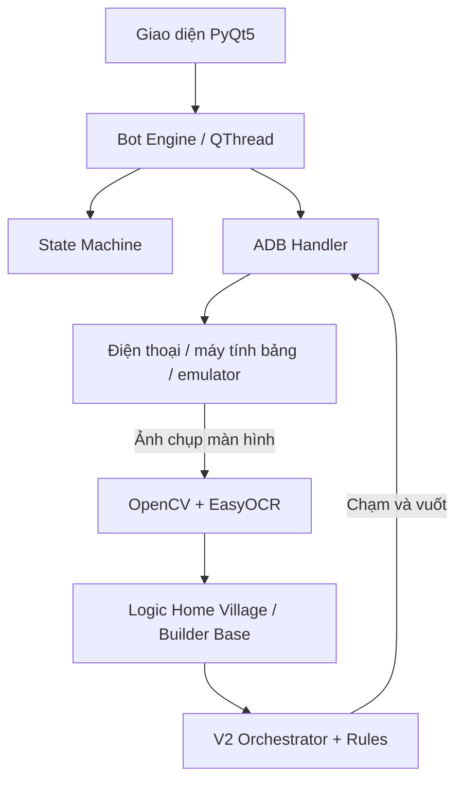

# 🤖 CoC Mạnh Farmer

Bot tự động farm **Clash of Clans** chạy trên máy tính Windows. Bot chụp màn hình thiết bị Android qua ADB, dùng OpenCV và EasyOCR để nhận diện giao diện, sau đó mô phỏng thao tác chạm/vuốt để tìm trận và triển khai quân.

<div align="center">
  
  
  
  
  
</div>

> [!WARNING]
> Dự án phục vụ mục đích học tập và nghiên cứu tự động hóa giao diện. Bot không sửa APK, không đọc bộ nhớ game và không can thiệp gói tin mạng. Tuy nhiên, sử dụng bot trong trò chơi trực tuyến có thể vi phạm Điều khoản dịch vụ của Supercell và khiến tài khoản bị khóa. Bạn tự chịu trách nhiệm khi sử dụng.

## Tính năng

- Tự nhận độ phân giải (`wm size`) và mật độ màn hình (`wm density`).
- Hỗ trợ điện thoại, máy tính bảng và các emulator như LDPlayer hoặc BlueStacks.
- Dùng OCR để đọc Gold, Elixir và Dark Elixir; tự bỏ qua làng không đạt ngưỡng tài nguyên.
- Tùy chọn thỉnh thoảng bỏ qua 1–2 làng dù đủ tài nguyên, cho nhịp tìm trận đỡ đều đặn.
- Nhận diện nút, quân, hero, spell và công trình bằng template matching.
- Tự tìm trận, triển khai quân, kích hoạt kỹ năng hero và thả spell.
- Tùy chọn đọc lại thanh quân sau khi đánh xong và thả nốt thẻ nào còn quân.
- Hỗ trợ Home Village và Builder Base nhiều giai đoạn.
- Tự phát hiện mất kết nối, popup bất thường và trạng thái bị kẹt.
- Có các profile hiệu năng `Ultra`, `High`, `Medium`, `Low` và `Smart Default`.
- Cho phép chỉnh cấu hình chiến thuật bằng JSON và hot reload khi bot đang chạy.

## Các chiến thuật

| Chiến thuật | Cách hoạt động |
| --- | --- |
| **Perimeter Sweep** | Vuốt nhanh quanh bốn cạnh an toàn của map. Mỗi loại quân có điểm bắt đầu và chiều chạy được chọn ngẫu nhiên. |
| **Resource Raid** | Thăm dò và thả quân gần các kho tài nguyên. |
| **Ground Funnel** | Tạo hai cánh funnel rồi triển khai đội hình chính vào trung tâm. |
| **Air Attack** | Rải quân bay theo hình quạt trên hành lang an toàn. |
| **Town Hall Snipe** | Tìm Town Hall và triển khai tại điểm an toàn gần mục tiêu. |
| **Smart Default** | Chọn hành lang rộng nhất và triển khai đội hình hỗn hợp. |

### Perimeter Sweep

Chiến thuật được bổ sung trong repository này:

1. Nhận diện vùng cấm thả quân và bốn hành lang an toàn quanh base.
2. Tạo một đường khép kín gồm nhiều đoạn vuốt quanh map.
3. Với mỗi loại quân, chọn ngẫu nhiên điểm bắt đầu và chiều thuận/ngược.
4. Thêm jitter vào tọa độ, tốc độ và thời gian nghỉ để thao tác không lặp lại tuyệt đối.
5. Nếu không nhận diện đủ bốn cạnh an toàn, bot tự chuyển sang `Smart Default`.

Thông số nằm trong `config/v2_attack_rules.json`:

```json
"perimeter_sweep": {
  "clearance_px": 30,
  "min_corridor_width_px": 16,
  "points_per_side": 3,
  "swipe_duration_ms": 280
}
```

## Kiến trúc



Chi tiết cách bot chạy bên trong — vòng tick, state machine, hệ tấn công V2,
đường dự phòng — xem [docs/architecture.md](docs/architecture.md).

## Yêu cầu

- Windows 10 hoặc Windows 11.
- Python 3.10 hoặc 3.11.
- Thiết bị Android hoặc emulator đã bật USB/Wireless Debugging.
- ADB nhận diện được thiết bị.
- Khuyến nghị thử trên tài khoản phụ, không dùng tài khoản có giá trị.

## Cài đặt

### 1. Clone repository

```powershell
git clone https://github.com/manhnd121198/coc-manh-farmer.git
cd coc-manh-farmer
```

### 2. Tạo môi trường Python

```powershell
python -m venv venv
venv\Scripts\activate
```

### 3. Cài thư viện

```powershell
python -m pip install --upgrade pip
pip install -r requirements.txt
```

EasyOCR có thể tải model trong lần chạy đầu tiên, vì vậy máy cần kết nối Internet.

### 4. Kết nối thiết bị

```powershell
.\2adb.exe devices
```

Thiết bị phải xuất hiện với trạng thái `device`. Nếu hiện `unauthorized`, mở khóa điện thoại và chấp nhận yêu cầu cấp quyền gỡ lỗi.

### 5. Khởi chạy

```powershell
python main.py
```

## Dùng Perimeter Sweep

1. Mở tab **Home Village**.
2. Chọn quân, hero và spell muốn sử dụng.
3. Bật **Enable V2 (Red-Zone-Aware Smart Deploy)**.
4. Trong **V2 Rule**, chọn **Perimeter Sweep — random-start swipes around map**.
5. Kiểm tra game đang mở và thiết bị đã kết nối ADB.
6. Bắt đầu bot và theo dõi vài trận đầu để hiệu chỉnh cấu hình.

Các thông số nên điều chỉnh:

- `points_per_side`: số điểm trên mỗi cạnh; tăng giá trị sẽ tạo nhiều đoạn vuốt hơn.
- `swipe_duration_ms`: thời gian của mỗi đoạn vuốt. Vuốt quá chậm có thể bị game hiểu là kéo camera.
- `clearance_px`: khoảng cách với đường biên đỏ.
- `tap_jitter_px`: độ lệch ngẫu nhiên của tọa độ thao tác.

## Cấu trúc thư mục

```text
.
├── main.py                    # Điểm khởi chạy ứng dụng
├── requirements.txt           # Thư viện Python
├── config/                    # Cấu hình CSR, quân và spell
├── core/                      # ADB, engine, state machine và logging
├── logic/
│   ├── rules/                 # Các chiến thuật tấn công
│   └── skills/                # Planner và thao tác điều khiển
├── vision/                    # OpenCV, OCR và nhận diện vùng an toàn
├── ui/                        # Giao diện PyQt5
├── assets/templates/          # Ảnh mẫu dùng để nhận diện
├── profiles/                  # Profile người dùng
├── recordings/                # Macro đã ghi
└── tests/                     # Unit test
```

## Chạy kiểm thử

```powershell
python -m unittest discover -s tests -v
```

## Lưu ý an toàn

- Repository có kèm `2adb.exe` và các DLL dành cho Windows. Nếu cần độ tin cậy cao hơn, hãy thay chúng bằng ADB từ [Android SDK Platform Tools](https://developer.android.com/tools/releases/platform-tools).
- Không chạy file hoặc cấu hình tải từ nguồn không tin cậy.
- Không chia sẻ log, profile hoặc ảnh chụp có chứa thông tin tài khoản.
- Không có cơ chế nào bảo đảm bot tránh được phát hiện hoặc tránh khóa tài khoản.

## Giấy phép

Dự án được phát hành theo giấy phép [MIT](LICENSE). Xem thêm cảnh báo tại [DISCLAIMER.md](DISCLAIMER.md).
